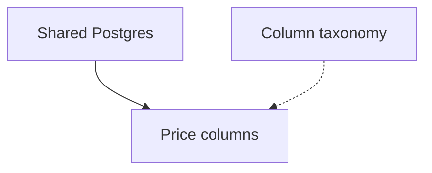

# Fleet atlas schema

The wire format of `docs/fleet-atlas/` has one index at `docs/fleet-atlas/index.md` and one file
per shared area at `docs/fleet-atlas/<key>.md`. The directory that holds `docs/fleet-atlas/` is the
fleet root, and every fleet script takes it as its first argument. One fleet has one fleet atlas, in
one repo: the repo that reads every other. A repo that holds both a repo atlas and the fleet atlas
holds them in two directories that never point at each other.

A shared area is something two or more repos share, of one of two kinds and no more. An
**implementation** is code one repo owns and other repos consume. A **contract** is a shape every
side implements on purpose, such as a column set or a file format, and carries a revision that only
goes up. Every cross-repo relation routes through a shared area. There is no third kind and no
attribute on a kind.

A key is minted by the repo schema's rule and nothing else: lowercase the name and turn spaces into
hyphens, once, when the shared area is created. The file name without `.md` is the permanent key.
Renaming the file is the one forbidden move. Every pointer, an edge entry, a Sides head, an index
link, a graph node id, names a key exactly as written, and nothing normalizes a pointer on the way to
the file.

Every fleet sitting reads and writes this shape and no other. There is one accepted form of it,
with no fallback and no version tolerance. [scripts/check-fleet.sh](scripts/check-fleet.sh) reports
drift as a defect, not a style choice. The repo schema in [SCHEMA.md](SCHEMA.md) is unchanged by
this one; the two share their header rules through one library, so a rule holds in both or in
neither.

**Relations live only here.** A repo's area file never names a shared area or another repo. Its
header vocabulary stays the closed set SCHEMA.md states, and a line naming a shared area there is
`bad-vocabulary` in the repo gate. A repo learns what it implements or consumes by reading the
fleet atlas, and restates none of it in its own map.

**The index holds no fact of its own.** Its shared-area table and graph block are generated from
the shared area files. [scripts/render-fleet-index.sh](scripts/render-fleet-index.sh) is the only
writer of either, and the gate byte-compares both against what that script would write.

## The index at `docs/fleet-atlas/index.md`

The first heading holds the fleet atlas's title. The header block below it carries exactly one
`Repos:` line: a comma-separated list of repo names, each in key form. It is the closed set a side
may name and an `Owner:` line may name. The header vocabulary is `Repos` alone. There is no
`Ignore:` line, because the fleet atlas holds no code, and the gate reports one as
`bad-vocabulary`, the same as any other key. Then five sections, in this order.

````markdown
# Grid fleet

Repos: gridwatch, gridcore, gridedge

## Orientation

Three repos share one warehouse. gridcore owns the Postgres it runs on, gridwatch draws charts from
the conformed price columns, and gridedge writes raw observations at the edge. The columns are the
contract the other two lean on; the taxonomy behind them is still being decided.

## Shared areas

<!-- atlas-table:begin — generated from the area files; do not hand-edit -->
| Shared area | Kind | Owner or revision | Understood |
| --- | --- | --- | --- |
| [Shared Postgres](shared-postgres.md) | implementation | gridcore | ✅ |
| [Price columns](price-columns.md) | contract | 3 | 🔶 |
| [Column taxonomy](column-taxonomy.md) | contract | 1 | ❌ |
<!-- atlas-table:end -->

## Graph block

<!-- atlas-graph:begin — generated from area edge lines; do not hand-edit -->

<!-- atlas-graph:end -->

## Fog

- Secrets access. Every repo reads the same vault the same way, and nobody has written the way down.

## Out of scope

- A shared build image. Each repo builds its own; ruled out 2026-08-31 because the three toolchains
  do not overlap.
````

### Orientation

One paragraph: what the fleet is, which repos are in it and where the couplings are. The low-cost
load every fleet sitting starts from.

### Shared areas

Generated, between the `atlas-table` marker pair the repo index uses. One row per shared area: the
current display title linked to the key file, the kind, then the owner repo for an implementation or
the current `Revision:` integer for a contract, then the understood symbol. Every cell is derived
from the shared area file. Row order is the only thing here a person owns: the renderer keeps the
order already in the index, appends a shared area missing from it in key order, and drops a row
whose file is gone.

### Graph block

Generated, between the `atlas-graph` marker pair the repo index uses. One `key["Title"]` node per
shared area, then one edge per entry on an edge line, both kinds pointing from the shared area
waited on to the one that waits: a `Blocked-by:` entry is a solid `-->` arrow and a `Pending-on:`
entry is a dotted `-.->` arrow. Every solid edge sorted, then every dotted edge sorted. The graph
draws shared areas and the edges between them. Sides are not on it; a repo appears on the graph
nowhere.

### Fog

Fleet-level placeholders: couplings the PM can tell exist but cannot yet name or bound. One bullet
each. Fog graduates into a shared area file when a sitting can state its kind and its sides, and is
then removed from this section.

### Out of scope

Rulings, one bullet each: what was ruled out of the fleet and why. A ruling returns only when the PM
reopens it, as a new decision.

## A shared area file at `docs/fleet-atlas/<key>.md`

The first heading holds the current display title. The header block then carries its lines, one per
line, machine-greppable, and six sections follow.

The header vocabulary is closed to six keys: `Kind`, `Revision`, `Owner`, `Understood`,
`Blocked-by` and `Pending-on`. The gate reports any other non-blank line between the title and the
first `## ` heading as `bad-vocabulary`. There is no `Built:`. A contract's built-ness is its
sides' pins, and an implementation's is the owner area's own built axis in that repo's atlas, read
through the key. There is no `Owns:` and no `Imports:`, because the fleet atlas holds no code.

| Line | On a contract | On an implementation |
| --- | --- | --- |
| `Kind:` | `contract` | `implementation` |
| `Revision:` | mandatory, a positive integer | absent |
| `Owner:` | absent | mandatory, a repo named in `Repos:` |
| `Understood:` | `❌`, `🔶` or `✅` | the same |
| `Blocked-by:` | mandatory, shared-area keys or `none` | the same |
| `Pending-on:` | optional, shared-area keys | the same |

A file whose `Kind:` disagrees with its pairing line, a contract with `Owner:`, an implementation
with `Revision:`, both lines present or neither, is `bad-vocabulary`.

A contract:

```markdown
# Price columns

Kind: contract
Revision: 3
Understood: 🔶
Blocked-by: shared-postgres
Pending-on: column-taxonomy

## Gist

The conformed price columns every repo reads and writes: name, type, unit and nullability, one
row per instrument per interval.

## Sides

- gridwatch:charting @3
- gridcore:warehouse @2, moves at the next warehouse release
- gridedge:uncharted, the edge writer has no map yet

## Open decisions

- [ ] Does a settlement price get its own column or a flag on the close?

## Options and why

- Timestamps are UTC with no zone column. Presented: a zone column, a zone in the instrument
  table, UTC everywhere. Picked UTC everywhere; it cost gridedge a conversion at write time.

## Revisions

- 3, 2026-08-31: added the settlement column
- 2, 2026-07-14: nullability stated per column
- 1, 2026-06-02: first cut

## Links

- [ADR-0004: one column set for the fleet](https://example.invalid/gridcore/blob/main/docs/adr/0004-one-column-set.md)
```

An implementation:

```markdown
# Shared Postgres

Kind: implementation
Owner: gridcore
Understood: ✅
Blocked-by: none

## Gist

The one Postgres the fleet writes to. gridcore provisions it, migrates it and holds its
credentials; every other repo connects and nothing more.

## Sides

- gridwatch:storage
- gridedge:uncharted, connects from the edge writer once it is charted

## Open decisions

None.

## Options and why

- One cluster, not one per repo. Presented: a cluster per repo, one cluster with a schema per
  repo, one cluster and one schema. Picked one cluster with a schema per repo.

## Links

- [Spec: shared Postgres provisioning](https://example.invalid/gridcore/issues/31)
```

### Gist

What the shared area is, in a few lines. Enough to decide whether to open the rest.

### Sides

One bullet per side, machine-greppable. A bullet is a head, an optional pin, then optional prose
after a comma. The gate reads nothing past the first comma.

```markdown
- <head> @<n>, <prose>
```

The head is one of three forms. `<repo>` is always a name in `Repos:`.

| Head | Means |
| --- | --- |
| `<repo>:<key>` | an area key in that repo's own atlas |
| `<repo>:uncharted` | a side in a repo that has no area for it yet |
| `<repo>` | the repo as a whole, for a contract every repo implements without a dedicated area |

On a contract, a charted head and a whole-repo head each carry ` @<n>`, a positive integer no
greater than `Revision:`. An uncharted head carries no pin, because unwritten code pins nothing,
and is never stale. On an implementation no head carries a pin; the sides are the consumers, and
the owner is the `Owner:` line and does not appear as a side. Two uncharted heads in one shared
area are legal and told apart by their prose.

The whole-repo head is for a convention the fleet keeps as a contract, such as the atlas schema
every repo's map is written in. It saves minting a fake area in each repo to hold a pin:

```markdown
- gridwatch @2
- gridcore @2
- gridedge @1, charts on the old form until its first sitting
```

A charted head is checked against the repo it names. When that repo's checkout has `docs/atlas/`
and no `<key>.md`, the gate reports `orphan-relation`: a key is never renamed, so the area was
deleted. A repo whose checkout has no `docs/atlas/` is legal, and every charted head naming it
reads as uncharted. A whole-repo head carries a pin and never reads as uncharted, because it names
the repo and not an area in its map. A bullet that breaks any rule here is `bad-vocabulary`.

### Understood

One axis, moved only on enumerable facts, and the only axis a shared area carries. The values are
`❌`, `🔶` and `✅`, read off Open decisions, Options and why, and the `Pending-on:` line, exactly as
the repo schema's understood axis is.

| Value | Condition |
| --- | --- |
| ❌ | No decision in the shared area has been resolved |
| 🔶 | Some decisions are resolved and open decisions remain |
| ✅ | The open-decisions list is empty and the file carries no `Pending-on:` line |

A shared area with a `Pending-on:` line at ✅ understood is `axes-contradiction`.

### Edge lines

Two edge kinds, between shared areas only, in the repo schema's form. `Blocked-by:` is mandatory,
exactly one line, and means "must exist before any side can implement this one": the price columns
wait on the shared Postgres existing, so `price-columns.md` carries `Blocked-by: shared-postgres`.
`Pending-on:` is optional, at most one line, and means what it means in a repo: a decision open on
the named shared area must resolve first. Both hold comma-separated shared-area keys used exactly
as written. `Blocked-by: none` is the one literal; there is no `none` for `Pending-on:`.

An entry that is not key form is `bad-vocabulary`; a well-formed key with no file is `bad-edge`; a
`Pending-on:` entry naming a shared area at ✅ understood is `pending-resolved`, and the fix is to
remove the entry. An edge line never names a repo or a repo's area. That relation is a side.

### Open decisions

The shared area's unresolved decisions, one checkbox each, `- [ ] <the question>`. This list is the
understood axis's input.

### Options and why

The one home for a fleet-wide decision. One bullet per resolved decision: the options presented,
what was picked, and what it cost. Every repo reads the decision here, and no repo's area file and
no handoff file restates it. When the resolution lives in an ADR or a spec, gist it in one line and
link it.

### Revisions

One bullet per revision number a contract has had, newest first: the number, then prose, a release
name, a date, what changed.

```markdown
- <n>, <prose>
```

The machine fact is `Revision:` in the header. This section is its history, and the home of the
names a release wants. An implementation carries no revision and may omit the section.

**A revision bump is one edit.** `Revision:` moves up by one, a Revisions bullet is added, and every
side that moved with it takes the new pin, in the same edit. A side that did not move keeps its old
pin, and the queue reports it as `stale-contract` from then on. That is why a pin above
`Revision:` is `bad-vocabulary` and not a state: it can only mean the bump was half-written. Pins
are this atlas's record of what each side implements. Keeping them true against the repos is the
plane's observation, designed in the repo that holds the fleet atlas.

### Links

Pointers out: the ADRs, specs and merged PRs made on the shared area, one bullet each, a title and
a pointer. The repo touch's titling convention in [TOUCH.md](TOUCH.md) applies to the title head.

## The fleet sitting

`/atlas fleet` enters this sitting, and [SKILL.md](SKILL.md) holds the rule that chooses it over
the repo sitting. The shape is the repo sitting's: orient, advise, record, one bite, end.

1. Orient. Load the fleet index and run [scripts/fleet-queue.sh](scripts/fleet-queue.sh) against
   the fleet root with every attached repo's checkout, one `<repo>=<path>` per name on the index's
   `Repos:` line: `scripts/fleet-queue.sh . gridcore=. gridwatch=../gridwatch gridedge=../gridedge`. State the
   horizon from the index: which contracts carry a side behind their revision, which shared areas
   wait on another existing (a solid edge) and which wait on a decision (a dotted edge). Then work
   the queue from the top. It prints four classes in one order, and the sitting takes them in that
   order with one move each; [SITTING.md](SITTING.md) holds the detail per class.

   | Class | The move |
   | --- | --- |
   | stale-contract | The plane files the issue on the lagging repo, or the sitting rules the side may lag and records why in Options and why. |
   | cross-repo-cycle | Name it as intended, or reclassify a kind. |
   | uncharted-side | Request a charting session in that repo, or resolve the head to a key when the repo has since charted. |
   | fog | Name it into a shared area when its kind and sides can be stated. Otherwise leave it. |

   Open a shared area file only when the sitting turns to it. A side's code lives in the repo the
   head names, and that repo's [scripts/drill-down.sh](scripts/drill-down.sh) run at that checkout
   answers where.

2. Advise. Impact of a change to a shared area is read off the fleet graph and the Sides: walk both
   edge types to name every shared area the change touches, then read each one's Sides to name
   every repo. A contract bump reaches every side that pins it; an implementation change reaches
   every consumer. The PM judges the cost across repos before committing to it.

3. Record what the sitting decided. A fleet-wide decision lands once, in the shared area's Options
   and why, and comes off its Open decisions; every repo reads it there and no repo area file or
   handoff restates it. A relation the sitting drew or cut lands on a Sides bullet or on the
   `Blocked-by:` or `Pending-on:` line of a shared area. Understood moves only on the facts this
   file states. Every edit inside `docs/fleet-atlas/` ends with the fleet touch below, and the move
   is not recorded until the gate is silent.

4. One fleet bite. A bite is one of: a revision bump on a contract, which is one edit, `Revision:`
   up by one, a Revisions bullet, and the sides that moved take the new pin; a side resolved from
   uncharted to a key; a shared area minted from fog; a fleet-wide decision recorded once. Work
   the bite implies in another repo, the issue the plane files or the charting session requested,
   exits through the tracker and is not started here.

5. End. One bite per sitting.

## The gate and the queue

Both scripts take the fleet root, then every attached repo as `<repo>=<path>`, one argument per
repo named in `Repos:`. A repo in `Repos:` with no path, or a path for a repo not in `Repos:`, is a
usage error, exit 2, so a partial check never reads as green.

[scripts/check-fleet.sh](scripts/check-fleet.sh) is the gate. It checks the facts the fleet atlas
and the attached repos' atlases settle together as documents, is silent with exit 0 when clean, and
prints one `DRIFT` line per finding with exit 1 when not. Six classes, enumerated once in the
script's header, which is the home of the detail:

- `bad-vocabulary`, a malformed header line or Sides bullet, an undefined header key in a shared
  area or the index, an unknown repo, a pin above the revision, a `Kind:` whose pairing line
  disagrees.
- `bad-edge`, a `Blocked-by:` or `Pending-on:` entry naming a shared-area key with no file.
- `axes-contradiction`, a ✅ shared area carrying a `Pending-on:` line, or an axis that contradicts
  the file's own record.
- `pending-resolved`, a `Pending-on:` entry naming a shared area at ✅ understood.
- `stale-index`, a generated region of the index differing from what the renderer would write.
- `orphan-relation`, a side head `<repo>:<key>` where the repo's checkout has `docs/atlas/` and no
  `<key>.md`.

[scripts/fleet-queue.sh](scripts/fleet-queue.sh) is the report the sitting works. It compares the
fleet atlas to the repos' progress, prints one `GAP` line per finding, and exits 0 always. Four
classes, printed in this order, enumerated once in the script's header:

- `stale-contract`, a contract side pinned below the current `Revision:`, one line per side.
- `cross-repo-cycle`, a cycle in who consumes whom, where each implementation draws an edge from
  every consumer repo to the owner repo and contracts draw nothing; one line per distinct cycle.
- `uncharted-side`, a side whose head is `<repo>:uncharted`, or a charted head `<repo>:<key>`
  whose repo has no `docs/atlas/` in its checkout, one line per side.
- `fog`, one line per index Fog bullet, unadorned.

Nothing that measures another repo's progress is in the gate, and nothing that needs a judgment is.
A side behind its contract is a question the plane turns into an issue on the lagging repo, and a
cycle is a question for the sitting; neither is a defect in the fleet atlas.

## The fleet touch

Every edit inside `docs/fleet-atlas/`, in a sitting or by the plane, ends the same way: run
[scripts/fleet-touch.sh](scripts/fleet-touch.sh) on the fleet root with every attached checkout. It
renders the index, then runs the gate, which must be silent before the flow moves on. The procedure and the reason it lives with the sitting are in
[SITTING.md](SITTING.md). A repo landing never touches the fleet atlas, because under the rule that
relations live only here no repo landing can know it touched a shared area.
