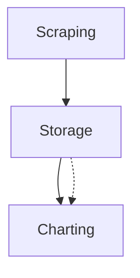

# Atlas schema

The wire format of `docs/atlas/` in a project repo has one index at `docs/atlas/index.md` and one
file per area at `docs/atlas/<area-key>.md`. The file name without `.md` is the permanent area key.
Set it when the area is created and never rename the file. The `# Title` heading is the current
display title and can change at any time.

A key is lowercase letters, digits and hyphens. Every pointer names one, and nothing normalizes a
pointer on the way to the file: index links, `Blocked-by:` entries, `Pending-on:` entries, `Area:`
lines and graph node ids are all keys, used exactly as written. A pointer in any other form is an
error the checker names. Never resolve an area by searching its display title.

A name becomes a key exactly once, when an atlas session first creates the area: lowercase it and
turn spaces into hyphens. From then on the key is fixed and no code does that conversion again.
Renaming the file is the one forbidden move, so the key outlives every title the area is given.

Every atlas session reads and writes this shape and no other. There is one accepted form of it,
with no fallback and no version tolerance. A deterministic checker reports drift as a defect, not a
style choice.

What two or more repos share is a second shape, `docs/fleet-atlas/` in one repo, stated in
[FLEET.md](FLEET.md). An area file here never names a shared area or another repo; its header
vocabulary is the closed set below.

**The index holds no fact of its own.** Its area table and graph block are both generated from the
area files, so neither can disagree with them. `scripts/render-index.sh` is the only writer of
either, and `scripts/check-atlas.sh` byte-compares both against what that script would write.

## The index — `docs/atlas/index.md`

The first heading holds the atlas's title. The header block below it may carry one `Ignore:` line.
The Claims section states its language. The header block's vocabulary is closed: `Ignore:` is the
only key it accepts, and the checker reports any other non-blank line between the title and the
first `## ` heading as `bad-vocabulary`, and a second `Ignore:` line the same way. Then five
sections, in this order.

### Orientation

One paragraph: what the project is and where it is headed. The low-cost load every session starts
from.

### Area table

Generated, between markers. One row per area: the current display title linked to the key file,
then both axis values copied from that file. Every cell is derived, so the table restates the area
files for orientation and can never contradict them.

Row order is the only thing here a person owns. `render-index.sh` keeps the order already in the
index, appends an area missing from it in key order, and drops a row whose file is gone. So a table
hand-ordered to follow a pipeline stays in that order through every regeneration.

```markdown
<!-- atlas-table:begin — generated from the area files; do not hand-edit -->
| Area | Understood | Built |
| --- | --- | --- |
| [Scraping](scraping.md) | 🔶 | ✅ |
| [Charting](charting.md) | ❌ | ❌ |
<!-- atlas-table:end -->
```

### Graph block

Generated, between markers. One node per area, keyed by file name and labelled with the current
`# Title` heading, then one edge per dependency. Both edge kinds point from the area waited on to
the area that waits. A `Blocked-by:` entry is a solid arrow: `Blocked-by: scraping` in
`charting.md` yields `scraping --> charting`. A `Pending-on:` entry is a dotted arrow:
`Pending-on: storage` in `charting.md` yields `storage -.-> charting`. So a reader can tell "waits
on code" from "waits on a decision" without opening a file. The edge lines come in one order: every
solid edge sorted, then every dotted edge sorted.

````markdown
<!-- atlas-graph:begin — generated from area edge lines; do not hand-edit -->

<!-- atlas-graph:end -->
````

The checker compares the region between the markers and never the marker lines themselves, so an
index whose marker comment still reads "generated from area Blocked-by lines" stays green. The
renderer never rewrites a marker line that is already present.

### Fog

Atlas-level placeholders: areas the PM can tell are coming but cannot yet name or bound. One bullet
each, as loose or as full as the view allows. Fog graduates into a named area file when a session
can state its gist; it is then removed from this section.

### Out of scope

Rulings, one bullet each: what was ruled out and why. A ruling never graduates — it returns only if
the PM explicitly reopens it, and then as a new decision, not a resumption.

## An area file — `docs/atlas/<area-key>.md`

The first heading holds the current display title. Changing it does not change the area's identity.
The header block then has two axis lines, the build edge line, the optional decision edge line, the
optional claim line, and the optional import ruling, machine-greppable, one per line. Five sections
follow.

The header block's vocabulary is closed. Its keys are `Understood`, `Built`, `Blocked-by`,
`Pending-on`, `Owns` and `Imports`, and nothing else. The checker reports any other non-blank line
between the title and the first `## ` heading as `bad-vocabulary`, so a misspelled optional line is
named instead of silently meaning "claims nothing" or "waits on nothing". The match is on the key
prefix without the colon, the same way the axis checks match, so a line the axis or edge checks
already named is reported once and not twice.

```markdown
# <Current display title>

Understood: 🔶
Built: ❌
Blocked-by: scraping, storage
Pending-on: retention
Owns: src/charting, docs/charts
Imports: any

## Gist
...

## Open decisions
...

## Options and why
...

## Links
...
```

### Gist

What the area is, in a few lines. Enough to decide whether to open the rest.

### Status axes

Two separate facts, each moved only by an enumerable condition. The only axis values are `❌`,
`🔶`, and `✅`. The checker reports another value or a malformed machine-readable header as
`bad-vocabulary`. The same vocabulary applies to the index table.

**Understood** is read off the Open decisions and Options and why sections, and off the
`Pending-on:` line:

| Value | Condition |
| --- | --- |
| ❌ | No decision in the area has been resolved |
| 🔶 | Some decisions are resolved and open decisions remain |
| ✅ | The open-decisions list is empty and the area carries no `Pending-on:` line |

An area cannot be fully understood while a decision it depends on is open in another area. So an
area with a `Pending-on:` line at ✅ understood is `axes-contradiction`. That is the only axis rule
the decision edge adds; the built axis does not read it.

**Built** — read off the merge state of work carved from the area:

| Value | Condition |
| --- | --- |
| ❌ | Nothing carved from the area has merged |
| 🔶 | Some carved work has merged |
| ✅ | Everything carved from the area has merged and the area holds no fog |

One exception, for an area a survey mints: in a repo that already has code, the survey sets the
built axis from cited code evidence, a path or symbol named in the Gist or Links. This holds at
chart time and for an area the resurvey mints in a return sitting alike. From then on it moves only
on merge state. The understood axis gets no such exception: pre-existing code proves what was
built, not why, so a surveyed area starts at ❌ or 🔶 understood.

### Edge lines

The atlas has two edge kinds and no more. `Blocked-by:` says "build that first" and feeds the built
axis. `Pending-on:` says "decide that first" and feeds the understood axis. Both lines live in the
header block, both hold comma-separated lists of area keys used exactly as written, and the index
graph comes from these lines alone. No edge exists anywhere else. A third edge kind, or an attribute
on an edge, is out of scope: it needs a new decision, not an amendment to this one.

**`Blocked-by:`** is mandatory. Each area file has exactly one line. It contains the area keys that
must be built before this area can be, or the literal `Blocked-by: none`. Every area has a
build-order answer, so the line is always present.

**`Pending-on:`** is optional, at most one line. Absent means the area waits on no decision. Present
means a non-empty list of area keys whose open decisions this area waits on. `Pending-on: retention`
in `charting.md` means charting waits on a decision that is open in retention, and the graph draws
`retention -.-> charting`. There is no literal `none` for this line: absence already says that, and
the schema allows one spelling per fact. A `none` entry is `bad-vocabulary`. Most areas wait on no
decision, so a mandatory empty line in every file would carry no information.

Validation is the same for both lines. An entry that is not key form is `bad-vocabulary`; two
`Pending-on:` lines in one file is `bad-vocabulary`; a well-formed key with no file is `bad-edge`.

One class belongs to the decision edge alone. **`pending-resolved`** is a `Pending-on:` entry naming
an area whose understood axis is ✅. That area has nothing left to decide, so the edge is a fossil,
and the fix is to remove the entry. The condition is the named area's axis, not an empty
open-decisions list: an area at ❌ understood with nothing phrased yet is a legitimate thing to wait
on, and the gap queue's unphrased class already asks it to write its decisions down. When a touch
moves an area to ✅ understood, [TOUCH.md](TOUCH.md) removes every entry that names it in the same
touch.

A live `Pending-on:` edge keeps its area off the carvable frontier, the same way an unbuilt blocker
does. The skill's carve step reads both edge lines.

### Claims

`Owns:` says where the area's code lives. It is a comma-separated list of path patterns, written
against the root the atlas sits at — the directory that holds `docs/atlas/`, which every atlas
script takes as its argument. For a repo mapped from its own root those are the same directory. An
atlas nested inside a larger repository claims `src/scrape`, never the path from git's top level
down, so moving the package it maps rewrites no claim.

The patterns are git pathspecs and git evaluates them, so a pattern behaves in the map exactly as it
behaves in `git add` or `git grep`. A bare directory claims its whole subtree.
The exclude syntax is available: `Owns: src/store, :(exclude)src/store/vendor` claims the store and
drops the vendored tree inside it. A list of only exclusions claims everything else, which is git's
own reading of it and almost never what an area means.

Whitespace around a comma is trimmed. A comma inside a pattern is illegal, because the comma is the
separator. A quote inside a pattern is illegal too, so no reader has to unquote a pattern before it
can match.

Claims see **tracked files only**. Untracked scratch is never an area's code, and `git add` is what
makes a new file belong to the area whose pattern covers it.

Two areas may claim the same file. There is no precedence rule and no tie-break to remember. The
overlap is a boundary question, and a sitting settles it by narrowing a pattern.

A missing `Owns:` line is legal, in every area and at every stage. It reads as "this area claims
nothing."

**A claim that matches nothing is an intention.** The atlas is drawn ahead of the code, so an area
claims the paths its code will occupy and matches nothing until the first spec lands there. Nothing
that compares the map to the code belongs in the gate, so no claim can fail a landing.

[scripts/drill-down.sh](scripts/drill-down.sh) reads a claim. Give it an area key and it prints the
tracked files that area owns.

The index's `Ignore:` line uses the same language for the opposite job. It names the paths the map
deliberately does not cover, such as generated output and a vendored tree, so that they do not drown
a report of what no area claims. It bounds what the map is expected to reach, and says nothing about
a file some area already claims. A missing `Ignore:` line means nothing is ignored, and
`docs/atlas/` itself is exempt without being listed.

### The gap queue

[scripts/gap-queue.sh](scripts/gap-queue.sh) is the report the claims exist for. It compares the map
against the tracked files and prints the questions a sitting works, in one order: code in one area
that imports code in another area with no declared edge, then files two areas both claim, then code
no area claims, then a dead claim in a finished area, then an area at ❌ understood with nothing
written down as open, then the index's fog.

**It is a report and never a gate.** Every finding exits 0. A repo halfway through mapping itself
has a long queue and a green checker at the same time, and that is the correct state, not a failure.
Nothing that compares the map to the code can fail a landing.

The first class, `undeclared-dependency`, is where the map's edges meet the code's import graph.
A dependency is declared only when the importing area's `Blocked-by:` line names the imported area
directly. A chain through a third area does not declare it, and no other header line does, now or
later. The direction is the edge's own: A imports B means B is built first, which is `Blocked-by: B`
in A's file. The script's header holds the resolution rules, the roll-up and the supported languages.

**`Imports:`** is the ruling that ends that question for an area. It is optional, at most one line,
and its only legal value is `any`: `Imports: any` records that the area imports from anywhere by
design, so no edge is implied by its imports. The queue skips that area's importing side and still
reports other areas that import it. Any other value, an empty value, or a second line is
`bad-vocabulary`. The ruling is per area, not per pair, because the two cases it exists for are per
area: a test tree imports everything, and a presentation layer imports any workload.

That is also how a map adopts claims. An atlas with no `Owns:` line anywhere passes the checker
untouched and shows its whole tree in the queue as unclaimed. Working that queue **coarse first** —
claiming a whole subtree to an area, then letting a later sitting narrow whatever the queue reports
as contested — is the migration. There is no other step to it.

### Open decisions

The area's unresolved decisions, one checkbox each — `- [ ] <the question>`. This list is the
understood axis's input: resolving one moves it to Options and why; an empty list is ✅
understood. A decision the PM knows is coming but cannot yet phrase is fog, and belongs in the
index's Fog section, not here.

### Options and why

The board's memory: one bullet per resolved decision — the options presented, what was picked, and
what it cost. The code only ever shows the choice; this record keeps the options not taken. When
the resolution lives in an ADR or spec, gist it in one line and link it — never restate it.

### Links

Pointers out: the ADRs, specs, wayfinder maps, and merged PRs made inside the area. Work carved
from the area lands here as it is filed, so the built axis is a query over these links.

A bullet is **a title and a pointer**, and the **head of the title** says whether the bullet
records landed work or filed work. That is what makes the query answerable. Filing does not move
the built axis; landing does.

[TOUCH.md](TOUCH.md) step 1 is the single home of that titling convention — every flow that writes
a bullet reads it there, and it is not restated here.
